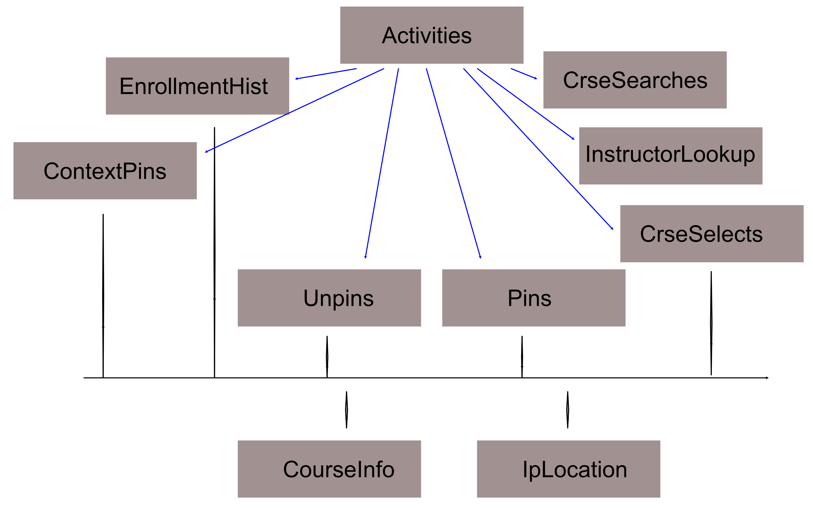

## Activity Log Exploration

Carta has maintained an activity log, which recorded high level visitor activities on the system. The log is semantically at a higher level than click streams in that entries are about activities, such as searching for a course or instructor, pinning, or unpinning courses. The log spans the time from Oct 2016 to Nov 2021, and contains 20,714,381 visitor activities

Each activity comes with related information. For example, a *pin* action log entry includes the course that was pinned, as well as the courses that the student has pinned earlier, and the courses in which they are enrolled at the time of the action.

The following access methods are available to analysts, in order of *time to skill level*, i.e. the amount and difficulty of required access technology: 

- Tableau natural language query (NLQ) access
- Tableau interactive visualization building
- Python/R access to the set of underlying database tables
- SQL access to the database tables

The natural language access is organized by analysis focus, such as origin and nature of an action, pinning and unpinning, enrollment, etc. Questions may include *"How many students?"* *"Pinned courses over time"*. *"Top 10 enrollments*". An [online tutorial](https://www.youtube.com/watch?v=27aIgkNyVa0) provides an in-depth introcudtion to this *Ask Data* facility. A [short getting-started section](#nql_getting_started] is provided below. The [NLQ access is available via the Web](https://us-west-2b.online.tableau.com/#/site/paepcke/datasources/15217696/askData).

The data from the activity log have been supplemented by information from Explore Courses, and location information by internet protocol address. These additional data are integrated in the activity datascape.

Figure 1 shows the activity log datascape (data model)  as a set of interconnected tables.

The *Activities* table at the top contains one row for each action. The supplemental information for the actions is stored in the tables connected by blue links. The black links contain information from external sources. All blue-linked tables are connected via the *row_id* primary key in each table.

##Activities Table

| Column Name              |   Example Entry         |
|--------------------------|------------------------|
|    row_id   | 1 |
|    student  | $2b$15$Kk3zHbZyk9q2K4skrd/47OvPtG/KBoE41TftO6xwO0Tz7cIgJlj46 |
|    ip_addr  | 171.66.16.37 |
|   category  | piin |
|  action_nm  | pin |
| created_at  | 2015-10-24 07:56:58 |

The activity categories that are likely of interest are:

- find_search/detailed_search : searching in the Carta search box at the top.
- get_course_info : a visitor has clicked on a search result course to find
                  details about the course.
- pin/unpin : use of the Carta course pinning feature
- instructor_profile : searching for instructor information.

## Pinning-Related Tables

The *Pin* and *Unpin* tables contain the course being handled. The quarters during which the respective pin/unpin actions occurred are available only via the *created_at* column of the *Activities* table. Again, to obtain information about the action associated with a particular pin in this table, use the *row_id* key to find information such as the date of the pin, the visitor hash, and more.

Some actions contain a list of all courses pinned during the action. Those 'contextual' pins are available in the 'ContextPins' table, which does include the quarter in which the pin occurred.

## Search-Related Tables

Only searches in the Carta course search box at the top of the interface are included in the *CrseSearchs* table. The table contains the search terms used. The action time in the associated *Activities* table *created_at* rows refer to the start of the visitor typing.

The *InstructorLookups* table contains the names of instructors for whom searches were entered in the search box at the top.

## Enrollment

The best source for enrollment continues to be the *student_enrollment* table in the Carta main database. However, as for pins, a number of actions include the enrollment history of the acting visitor. the *EnrollmentHist* table contains those context history lists.

## Auxiliary tables

The *CourseInfo* table contains information about each course, keyed by the *crse_id*: 

The *Pin* and *Unpin* tables contain the course being handled. The quarters during which the respective pin/unpin actions occurred are available only via the *created_at* column of the *Activities* table. Again, to obtain information about the action associated with a particular pin in this table, use the *row_id* key to find information such as the date of the pin, the visitor hash, and more.

Some actions contain a list of all courses pinned during the action. Those 'contextual' pins are available in the 'ContextPins' table, which does include the quarter in which the pin occurred.

## Search-Related Tables

Only searches in the Carta course search box at the top of the interface are included in the *CrseSearchs* table. The table contains the search terms used. The action time in the associated *Activities* table *created_at* rows refer to the start of the visitor typing.

The *InstructorLookups* table contains the names of instructors for whom searches were entered in the search box at the top.

## Enrollment

The best source for enrollment continues to be the *student_enrollment* table in the Carta main database. However, as for pins, a number of actions include the enrollment history of the acting visitor. the *EnrollmentHist* table contains those context history lists.

## Auxiliary tables

The *CourseInfo* table contains information about each course, keyed by the *crse_id*:

| Column Name          Example Entry
| ----------------- | ---------------------- |
| crs_id            | Six-digit course ID; use to tie to tables, such as *CrseSelection* |
| acad_yr           | 2015-2016 |
| subject           | AA |
| catalog_nbr       | 47SI |
| crs_code          | AA 47SI |
| crs_title         | Why Go To Space? |
| crs_description   | Why do we spend billions of dollars... |
| gers              | ('GER:DB-EngrAppSci', 'WAY-AQR', 'WAY-SMA') |
| grading_basis     | Satisfactory/No Credit |
| acad_group        | ENGR |
| acad_org          | AEROASTRO |

The *IpLocation* table includes information obout internet protocol address locations. This information is primarily of interest for summer and Covid-time visits to the site.

| Column Name        | Example Entry
|--------------------|-----------------|
|        row_id | 1 |
|  country_code | US |
|       country | United States |
|         state | California |
|          city | Stanford |
|           lat | 37.421262 |
|     longitude | -122.163949 |
|           zip | 94305 |
|     time_zone | -07 |00 |
| country_phone | 1 |
|     area_code | 650 |

## NQL Getting Started

Tableau's natural language query facility is relatively new. All Carta activity tables have been [introduced into Tableau Ask Data](https://us-west-2b.online.tableau.com/#/site/paepcke/datasources/15217696/askData), and uploaded to a server where natural language queries are available.

NLQ does not process complicated language. The processor uses the table and column names, as well as some understanding of statistics and visualization style smarts to make sense of text that users type. That said, we introduce synonyms, so that alternative vocabulary will work as well. Rather than having to use 'crse_id,' which is an integer denoting a course, one can use the word 'course' instead.  Thus, "How many crse_id" produces the same result as "How many courses?"

Queries may build on each other. For example:

    "How many courses?"

produces the number of courses mentioned in the log. One might continue with:

    "by year"

to get a time series line chart. If a barchart is prefered, one could continue with:

    "as barchart"

If you are familiar with using Tableau Desktop, worksheets evolving from the queries can be downloaded and then developed futher. Similarly, the data involved in a visualization can be downloaded to CSV for processing in R or Python.

The interface is organized into *lenses*, which hide tables or fields to focus attention on just one analysis task.  The lenses are human-created, and can be changed. The above mentioned synonyms are associated with lenses.

The change lens, go back to the [initial
URL](https://us-west-2b.online.tableau.com/#/site/paepcke/datasources/15217696/askData).

