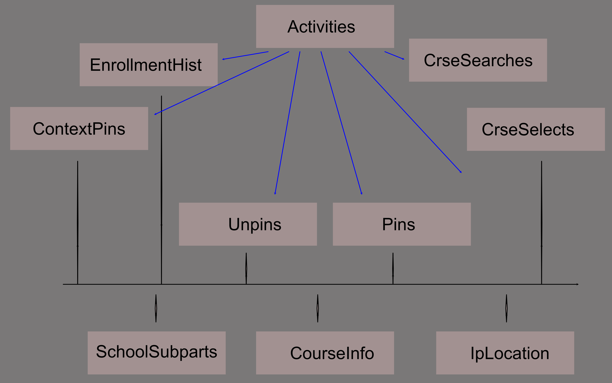

## Activity Log Exploration

Carta has maintained an activity log, which recorded high level visitor activities on the system. The log is semantically at a higher level than click streams, in that entries are about activities, such as searching for a course or instructor, pinning, or unpinning courses. The log spans the time from Oct 2015 to Nov 2021, and contains about 10M site visitor activities

Each activity entry includes an action identifyer, and comes with information related to that action. For example, a *pin* action log entry includes the course that was pinned, as well as the courses that the student has pinned earlier, and the courses in which they are enrolled at the time of the action. Similarly, search actions include the search term and Carta's returned results.

The following access methods are available to analysts, in order of required skill level:

- Tableau natural language query (AskData) access (**experimental**)
- Tableau interactive visualization building
- Python/R access to the set of underlying database tables
- SQL access to the database tables

The natural language access vocabulary is tied to the activity action, such as pinning, search, etc. Questions may include *"How many students?"* *"Pinned courses over time"*. *"Top 10 enrollments*". An [online tutorial](https://www.youtube.com/watch?v=27aIgkNyVa0) provides an in-depth introcudtion to this *Ask Data* facility. A [short getting-started section](#askdata-getting-started) is provided below. The [AskData access is available via the Web](https://us-west-2b.online.tableau.com/#/site/paepcke/datasources/15217696/askData).

The data from the activity log have been supplemented by information from Explore Courses, location information by internet protocol address, and Stanford's associations between departments, schools and subschools (in H&S).

Figure 1 shows the activity log datascape (data model)



as a set of interconnected tables.

These tables provide access to all the information in the activity log. The *Activities* table at the top contains one row for each action. The supplemental information that is stored with each action in every record of the activity table is distributed to the tables connected by blue links. The black links contain information from the mentioned external sources. All blue-linked tables are connected via the *row_id* primary key of each table.

## The Tables&mdash;Overview

Other than the central Activities table, there are seven tables filled with information from activity_log entries. In addition, three auxiliary tables are added for convenience: the course catalog, internet origins by IP address, and department/school/subschool relationships at Stanford:

- **Activities**: hub with one record per log entry. Holds the information common to all entries, such as time and student hash.
- **ContextPins**: some actions deposit a visitor's pins at the time of the action along with the action's other information. Those pinned courses are contained in the ContextPins table.
- **CourseInfo**: an excerpt of the course catalog; information can be joined with other tables via crs_id.
- **CrseSearches**: search terms and results from searches that visitors entered into the search box. Return information changed over time:
    * Early era (~2015) search results contain lists of zeroes, one for each course found. That is, only the number of results is available
    * Later, the PeopleSoft six-digit course ID numbers were returned for each course.
    * Later still, the results were separated into course results and instructor results.
- **CrseSelects**: visitor clicking on a search result
- **EnrollmentHist**: similar to ContextPins, the records for some actions include the visitor's enrollments
- **InstructorLookup**: visitor clicked on an instructor link to see their profile
- **IpLocation**: publicly available information about request origin. Mostly provided for Covid related investigations.
- **Pins**: course pin actions
- **SchoolSubparts**: for each course subject (CS, PHIL, ...), the responsible department, the School, and in the case of H&S the subschool
- **Unpins**: unpinning courses

## Strategy Tricks

The table columns are chosen to (reasonably) reflect their meaning, but also to enable joins that were anticipated to be of use. The *row_id* and *crs_id* stand out. The row_id ties all tables to each other, and in particular to the Activities table. The column is central to all investigations.

Here are some potential approaches that were imagined during the schema design. None have been tested.

- Join search terms or search results via crs_id or crs_code with the CourseInfo table. This procedure can enrich understanding of visitor intent.

For example, the CourseInfo entry example below could be found from the crs_id search results, or from a search term "AA 47SI". The reference would reveal all this additional information about the search, and the likely visitor intent.
```
             id: 1
         crs_id: 217539
        acad_yr: 2015-2016
        subject: AA
    catalog_nbr: 47SI
       crs_code: AA 47SI
      crs_title: Why Go To Space?
crs_description: Why do we spend billions of dollars exploring space? What can modern policymakers, entrepreneurs, and industrialists do to help us achieve our goals beyond planet Earth? Whether it is the object of exploration, science, civilization, or conquest, few domains have captured the imagination of a species like space. This course is an introduction to space policy issues, with an emphasis on the modern United States. We will present a historical overview of space programs from all around the world, and then spend the last five weeks discussing present policy issues, through lectures and guest speakers from NASA, the Department of Defense, new and legacy space industry companies, and more. Students will present on one issue that piques their interest, selecting from various domains including commercial concerns, military questions, and geopolitical considerations.
           gers: ('',)
  grading_basis: Satisfactory/No Credit
     acad_group: ENGR
       acad_org: AEROASTRO
```

- Use the IpLocation table joined to Activities for an estimate of visitors accessing from on&ndash;, versus off campus locations. This information might be of interest when looking for Covid related effects
- The entries in InstructorLookup are created by visitors expending the extra effort of clicking on a particular instructor to see their profile
- Use the ContextPins and EnrollmentHist tables to estimate a visitor's goal mindset during interactions.

## Activities Table

| Column Name              |   Example Entry         |
|--------------------------|------------------------|
|    row_id   | 1 |
|    student  | $2b$15$Kk3zHbZyk9q2K4skrd/47OvPtG/KBoE41TftO6xwO0Tz7cIgJlj46 |
|    ip_addr  | 171.66.16.37 |
|   category  | pin |
|  action_nm  | pin |
| created_at  | 2015-10-24 07:56:58 |


The activity categories that are likely of interest are:

- find_search/detailed_search : searching in the Carta search box at the top.
- get_course_info : a visitor has clicked on a search result course to find
                  details about the course.
- pin/unpin : use of the Carta course pinning feature
- instructor_profile : searching for instructor information.

## Pinning-Related Tables

The *Pin* and *Unpin* tables contain the course being (un)pinned during all (un)pin actions. The quarters during which the respective pin/unpin actions occurred are available only via the *created_at* column of the *Activities* table. Again, to obtain information about the action associated with a particular pin in this table, use the *row_id* key to find information such as the date of the pin, the visitor hash, and more. You are only concerned with this detail for access methods other than the natural language queries, which make that connection themselves. For the SQLers among you:


Given *Pins* table entry:

| Column Name   |  Example Entry |
|---------------|----------------|
| row_id        | 10354          |
| crs_id        | 105670         |

You could find out more via:

```
select * from Activities where row_id = 10354;
+--------+----------+---------------+-------------+-----------+---------------------+---------------------+
| row_id | student  | ip_addr       | category    | action_nm | created_at          | updated_at          |
+--------+----------+---------------+-------------+-----------+---------------------+---------------------+
|  10354 | $2b$1... | 10.31.192.169 | find_search | search    | 2015-10-26 01:18:11 | 2015-10-26 01:18:11 |
+--------+----------+---------------+-------------+-----------+---------------------+---------------------|
```

Some actions that are *not* about (un)pinning contain a list of all courses already pinned when the action is taken. Those 'contextual' pins are available in the *ContextPins* table, which includes the quarter in which the pin occurred. It is structured just like the *Pins* table.

## Search-Related Tables

Only searches in the Carta course search box at the top of the interface are included in the *CrseSearches* table. Not included are searches over course evaluations. The table contains the search terms used.

The *created_at* time in the associated *Activities* table rows refer to the start of the visitor typing. A visitor typing a search term generates many entries in the original activity_log, as typed term fragments are sent to Carta for eliciting result popups. Thus in the original log file there might be a log entry for "ph", another for "phys", and a third for "physics 123". These intermediate actions are filtered out from the tables provided here. This means that row_id are guaranteed to be monotonically increasing in time, but that not all row_id integers will be present. The 'missing' row_ids are the log entries of the partially typed search terms.

The search results from recent Carta years look like the following two rows:

| row_id | search_term       | crs_res                  | instructor_res              |
|--------|-------------------|--------------------------|-----------------------------|
|   1158 | physics 41a       | [123782, 125396, 125398] |     NULL                    |
|   1197 | Apple, strm: 1174 |                          | Mark Applebaum, Robin Apple |

When a search matched courses, the respective course IDs are noted. When an instructor matched, the hits are recorded in the *instructor_res* column.

The *InstructorLookups* table contains the names of instructors whose profile visitors requested.


## Enrollment

The best source for enrollment continues to be the *student_enrollment* table in the Carta main database. However, as for pins, a number of actions include the enrollment history of the acting visitor. the *EnrollmentHist* table contains those context history lists. These three entries from the *EnrollmentHist* table say "the visitor of action with *row_id* 10 in the *Activities* table was enrolled in three courses at the time they executed the logged action":

| row_id | crs_id |
|--------|--------|
|      10 | 102794 |
|      10 | 105644 |
|      10 | 105645 |

## Auxiliary tables

As seen in Figure 1, three tables external to the activity log information make queries more informative.

An example from the *CourseInfo* table:

| Column Name       |  Example Entry         |
| ----------------- | ---------------------- |
| crs_id            | Six-digit course ID; use to tie to tables, such as *CrseSelection* |
| acad_yr           | 2015-2016 |
| subject           | AA |
| catalog_nbr       | 47SI |
| crs_code          | AA 47SI |
| crs_title         | Why Go To Space? |
| crs_description   | Why do we spend billions of dollars... |
| gers              | ('GER:DB-EngrAppSci', 'WAY-AQR', 'WAY-SMA') |
| grading_basis     | Satisfactory/No Credit |
| acad_group        | ENGR |
| acad_org          | AEROASTRO |


The *IpLocation* table includes information obout internet protocol address locations. This information is primarily of interest for summer and Covid-time visits to the Carta site. During normal times most visitors will be located at Stanford.

| Column Name        | Example Entry
|--------------------|-----------------|
|        row_id | 1 |
|  country_code | US |
|       country | United States |
|         state | California |
|          city | Stanford |
|           lat | 37.421262 |
|     longitude | -122.163949 |
|           zip | 94305 |
|     time_zone | -07 |00 |
| country_phone | 1 |
|     area_code | 650 |

The *SchoolSubparts* table connects Stanford Schools, Departments, and course catalog subjects (CS, PHIL, etc.). Extract:

```
+----------+------------+--------------------------------+------------+-----------------+
| subject  | department | subschool                      | acad_group | subschool_short |
+----------+------------+--------------------------------+------------+-----------------+
| A&AHIST  | OLDSTANF   | Stanford University (Past)     | OLDSTANF   | OLDSTANF        |
| AA       | AEROASTRO  | NULL                           | ENGINEER   | ENGINEER        |
| PHIL     | PHILOSOPHY | H&S Div of Humanities & Arts   | HUMSCI     | H&SHumArts      |
| POLISCI  | SUPROGFLOR | H&S Div of Social Sciences     | HUMSCI     | H&SSocSci       |
| PWR      | VPUE       | NULL                           | VPUE       | VPUE            |
| SIW      | HUMSCI     | Humanities & Sciences          | HUMSCI     | H&SHumSci       |
| PE       | ATHLETICS  | NULL                           | DAPER      | DAPER           |
| PE       | MEDDPT     | NULL                           | DAPER      | DAPER           |
| PEDS     | PEDIATRICS | NULL                           | MEDICINE   | MEDICINE        |
```


The following section briefly introduces Tableau's emerging natural language facility. The system accepts semi constrained English queries, and generates charts by querying the underlying tables.

## AskData Getting Started

Tableau's natural language query facility is relatively new. All Carta activity tables have been [introduced into Tableau Ask Data](https://us-west-2b.online.tableau.com/#/site/paepcke/datasources/15217696/askData), and uploaded to a server where natural language queries are available.
[A brief written tutorial](https://help.tableau.com/current/pro/desktop/en-us/ask_data.htm), and [tutorial videos](https://www.youtube.com/watch?v=27aIgkNyVa0) are available.

AskData does not process complicated language. The processor uses the table and column names, as well as some understanding of statistics and visualization styles (bar chart vs. line chart) to make sense of text that users type. That said, our installation is initialized to 'understand' synonyms, so that alternative vocabulary will work as well. Rather than having to use 'crs_id in table CrseSelects,', one can use the word 'course' instead.

Queries may build on each other. For example:

    How many Students?

produces the number of courses mentioned in the log. One might continue with:

    by Year

to get a time series line chart. If a barchart is prefered, one could continue with:

    as a barchart

The AskData interface is organized into *lenses*, which hide tables or fields unimportant to particular analysis tasks. Lenses help analysts focus attention on just one line of inquiry.  The lenses are human-created, and can be changed. The above mentioned synonyms are associated with lenses. That is, each analysis task can have its own set of synonyms.

The change which lens to use, or to work in AskData using all tables at once, go back to the [initial
URL](https://us-west-2b.online.tableau.com/#/site/paepcke/datasources/15217696/askData).

If you are familiar with using Tableau Desktop, worksheets evolving from the queries can be downloaded and then developed further in the full application. From within Tableau Desktop they can be downloaded to CSV for processing in R or Python. This means that to turn charts back into csv tables you'll need to get a free-for-EDU copy of Tableau Desktop.

### Tips and Cautions

Tableau is still developing AskData, and the system can be finicky. 

- The best advice is to pay attention to the menus that pop down as you enter questions. Notice the table and fields to which each offer in the menu refers. You can consult the list of tables and fields on the left for the choice most likely to succeed.
- Note the pulldown menu on the upper right of the visualization pane. You can easily change to an alternative chart type.
- Each question is shown in more stylized terms above the question box. Check those terms to see whether the system grasped your intent. You can often pull down the boxes of the individual terms and reveal alternatives for you to choose, such as adding or removing from filters.
- Map Viz pulldown: Map, Text Table
- Country/City are based on the IP address of the Carta visitor, *not* from any university table.
- To pan maps: hold left mouse button for a couple of seconds, then move the mouse. Without the wait the move will result in a selection on the map.

### Example queries in the Course Search lens

    How many students by year?
       as barchart


    Students by Country
       exclude India
       <pull down the "filter Abc Country to India," and select Germany>
       <pull down again and uncheck India>


    Activities by city
       <pull down viz menu on the upper right and select Text Table>

    Number of students by city
       filter City Aachen
       <remove the 'filter Aachen'>
       not City Aachen

    How many students
       by Country
       by Year
       <pull Viz menu near upper right; select Map>

    CrseSelects by Gers
       <Always pick the CrseSelects option for Gers> in the pull-down menu>
       Gers(CourseInfo1) contains "WAY-FR"


    Instructors
       by year
       <select Text Table from Viz selection pulldown>
       <left click on one of the Year column headers and select sort-by-down symbol>
    top 10 Instructors
       by Year

    CrseSearches
       filter Search Term "english"

# Database Access

The authoritative source of data are the DB tables in MySQL on quintus.stanford.edu. Those with an account on that DB server can login via the command line:

```
mysql -h quintus.stanford.edu -u <uname> -p activity_log
```

If you are outside the Stanford network, you will need to VPN in first. For Sequel Pro users, Figure 2 shows the proper connection setup.

.

